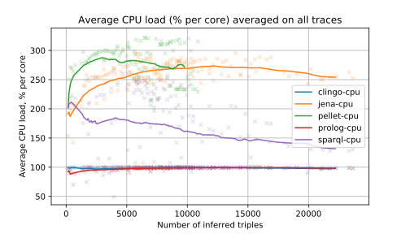
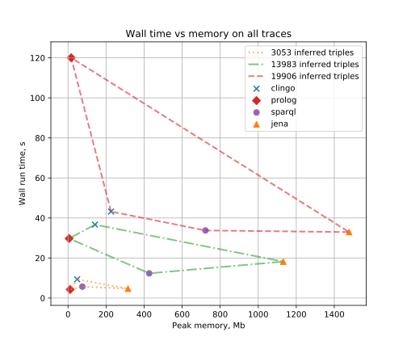
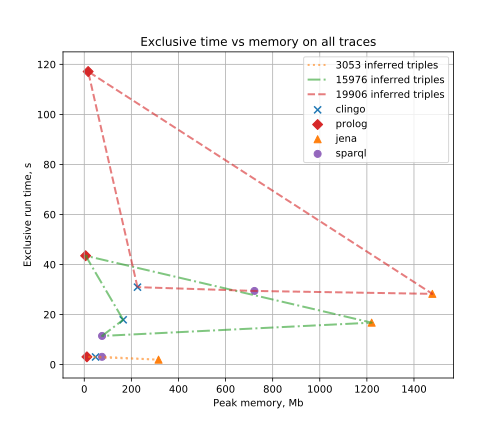
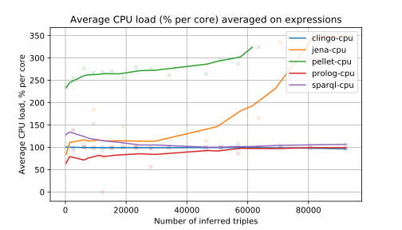
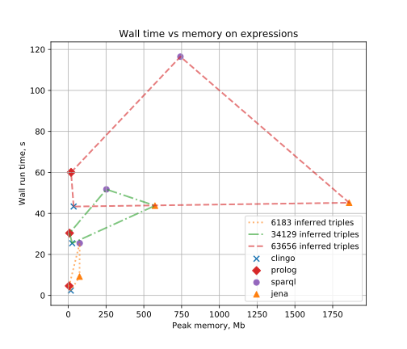
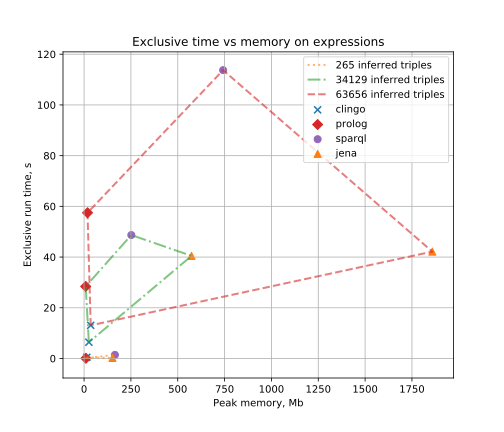
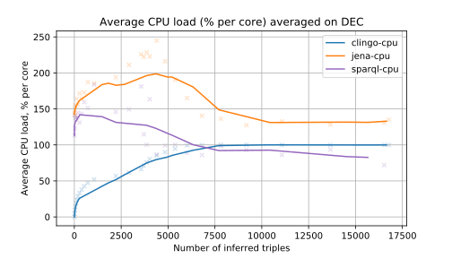
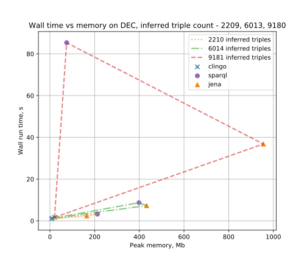
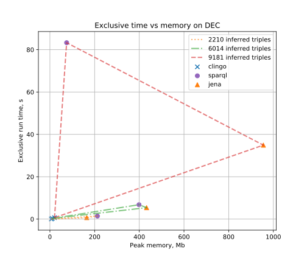

# Semantic Rule Engines Comparison (Supplemental Material)

Inference engines (reasoners) explored:

1. `Pellet` 2 \(also provides a plugin for Protege) is the only OWL reasoner supporting `SWRL` built-ins (arithmetics, strings and more).
2.  Apache `Jena` - RDF/OWL framework for Java having custom production rule syntax.
3.  SWI-`Prolog` with the semweb (rdf11) package for handling RDF data alongside prolog native predicates representing the domain rules.
4.  Apache Jena ARQ - a `SPARQL` query processor capable running batches of SPARQL Update queries imitating production rules.
5.  Closed World Machine (`CWM`) [seems impractical as not supported since 2008] - ancient reasoner written in Python 2 for RDF with its own rule syntax supporting some useful built-ins.
6. `Clingo` - Answer Set Programming (`ASP`) tool that combines `gringo` grounder and `clasp` solver \(handles data as ASP facts, no native support for RDF).
7. `DLV` [seems impractical as not supported since 2012] - another  ASP  solver  using  a  dialect  of  ASP  slightly  different  from Clingo’s one.

|        Feature        |    SWRL    | Jena Rules | SWI-Prolog + rdf11 |  SPARQL Update  | ASP (Clingo) |
|:---------------------:|:----------:|:----------:|:------------------:|:---------------:|:------------:|
| Open/Closed World     | OWA        | CWA        | CWA                | CWA             | CWA          |
| Arithmetic built-ins  | Yes        | Yes        | Yes                | Yes             | Yes          |
| Assert relations      | Yes        | Yes        | Yes                | Yes             | Yes          |
| Retract relations     | No         | Yes        | Yes                | Yes             | No           |
| Create individuals    | No         | Yes        | Yes                | Yes             | Yes          |
| Create classes        | No         | Yes        | Yes                | Yes             | Yes          |
| Data structures       | Plain      | Plain      | Nested             | Plain           | Nested       |
| Rule composition      | No         | No         | Yes                | Nested  SELECTs | No           |
| Negation support      | No         | Yes        | Yes                | Yes             | Yes          |
| Aggregates            | No         | No         | User-defined       | Built-in        | Built-in     |
| Integrity constraints | No         | No         | No                 | No              | Yes          |
| Check transitivity    | Assert all | Assert all | Recursion          | Property path   | Assert all   |
| Custom builtins       | Yes – Java | Yes – Java | Yes – Prolog       | No              | Yes – Lua    |
| Prioritize rules      | No         | No         | Ordering only      | Ordering only   | No           |

## Measurement

The following metrics recorded with each reasoner invoked as a standalone process:
* Input problem size.
* Number of input and output triples (the number of `inferred triples` is the difference). Note that no triples changed during reasoning (due to SWRL limitations constrained the way of solution).
* `wall time` is running time from the start of the reasoner process to its completion, including i/o, parsing of rules and data, serialisation of results (In the case of Clingo called via the clyngor Python library, the time of grammar-based parsing of the printout is also included).
* `exclusive time` is the pure reasoning time net any preparation and i/o. This metric is relevant when the calling code is in the same environment (ex. call Jena from java code).
* `CPU load` is average CPU usage in percent per core (similarily to Linux's `top` utility).
* `memory` is peak RAM consumption as the average between RSS (Resident Set Size, working set) and VMS (Virtual Memory Size - pagefile, private bytes). 

## Performance Evaluation Results
--------

### Traces domain, 3 datasets averaged

Wall run time | Exclusive reasoning time
--- | ---
_averaged_on_all_traces.svg) | _averaged_on_all_traces.svg)

Peak RAM commit | CPU usage
--- | ---
_averaged_on_all_traces.svg) | 

Pareto-like: Wall time/Memory | Pareto-like: Reasoning time/Memory
--- | ---
 | 

--------

### Expressions domain, 1 dataset

Wall run time | Exclusive reasoning time
--- | ---
_averaged_on_expressions.svg) | _averaged_on_expressions.svg)

Peak RAM commit | CPU usage
--- | ---
_averaged_on_expressions.svg) | 

Pareto-like: Wall time/Memory | Pareto-like: Reasoning time/Memory
--- | ---
 | 

--------

### Discrete Event Calculus (DEC) domain, 1 dataset

Wall run time | Exclusive reasoning time
--- | ---
_averaged_on_DEC.svg) | _averaged_on_DEC.svg)

Peak RAM commit | CPU usage
--- | ---
_averaged_on_DEC.svg) | 

Pareto-like: Wall time/Memory | Pareto-like: Reasoning time/Memory
--- | ---
 | 

